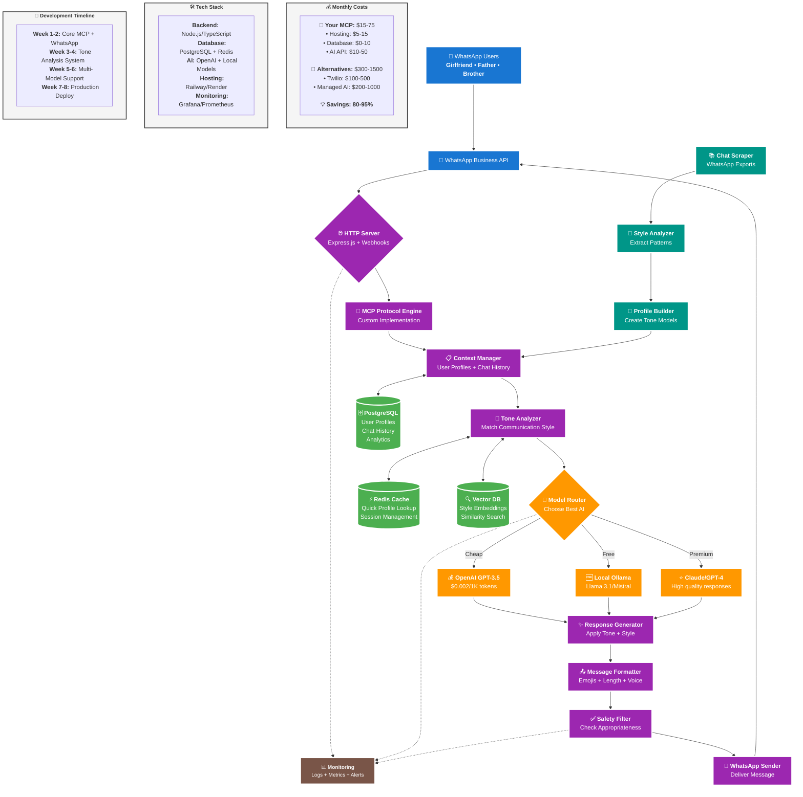

# WhatStyle

```mermaid
flowchart TD
    %% Users
    A[👥 WhatsApp Users<br/><b>Girlfriend • Father • Brother</b>] --> B[📱 WhatsApp Business API]
    
    %% Entry Point
    B --> C{🌐 <b>HTTP Server</b><br/>Express.js + Webhooks}
    
    %% Core MCP Engine
    C --> D[🧠 <b>MCP Protocol Engine</b><br/>Custom Implementation]
    D --> E[📋 <b>Context Manager</b><br/>User Profiles + Chat History]
    E --> F[🎯 <b>Tone Analyzer</b><br/>Match Communication Style]
    
    %% AI Processing
    F --> G{🤖 <b>Model Router</b><br/>Choose Best AI}
    G -->|Cheap| H[💰 <b>OpenAI GPT-3.5</b><br/>$0.002/1K tokens]
    G -->|Free| I[🆓 <b>Local Ollama</b><br/>Llama 3.1/Mistral]
    G -->|Premium| J[⭐ <b>Claude/GPT-4</b><br/>High quality responses]
    
    %% Response Generation
    H --> K[✨ <b>Response Generator</b><br/>Apply Tone + Style]
    I --> K
    J --> K
    K --> L[📤 <b>Message Formatter</b><br/>Emojis + Length + Voice]
    L --> M[✅ <b>Safety Filter</b><br/>Check Appropriateness]
    M --> N[📱 <b>WhatsApp Sender</b><br/>Deliver Message]
    N --> B
    
    %% Data Storage
    E <--> O[(🗄️ <b>PostgreSQL</b><br/>User Profiles<br/>Chat History<br/>Analytics)]
    F <--> P[(⚡ <b>Redis Cache</b><br/>Quick Profile Lookup<br/>Session Management)]
    F <--> Q[(🔍 <b>Vector DB</b><br/>Style Embeddings<br/>Similarity Search)]
    
    %% Training Pipeline
    R[📚 <b>Chat Scraper</b><br/>WhatsApp Exports] --> S[🔬 <b>Style Analyzer</b><br/>Extract Patterns]
    S --> T[👤 <b>Profile Builder</b><br/>Create Tone Models]
    T --> E
    
    %% Monitoring
    C -.-> U[📊 <b>Monitoring</b><br/>Logs + Metrics + Alerts]
    G -.-> U
    M -.-> U
    
    %% Cost Breakdown
    subgraph COSTS[💰 <b>Monthly Costs</b>]
        V["🔵 <b>Your MCP:</b> $15-75
        • Hosting: $5-15
        • Database: $0-10  
        • AI API: $10-50
        
        🔴 <b>Alternatives:</b> $300-1500
        • Twilio: $100-500
        • Managed AI: $200-1000
        
        💡 <b>Savings: 80-95%</b>"]
    end
    
    %% Tech Stack
    subgraph TECH[🛠️ <b>Tech Stack</b>]
        W["<b>Backend:</b> Node.js/TypeScript
        <b>Database:</b> PostgreSQL + Redis
        <b>AI:</b> OpenAI + Local Models
        <b>Hosting:</b> Railway/Render
        <b>Monitoring:</b> Grafana/Prometheus"]
    end
    
    %% Development Phases
    subgraph PHASES[🚀 <b>Development Timeline</b>]
        X["<b>Week 1-2:</b> Core MCP + WhatsApp
        <b>Week 3-4:</b> Tone Analysis System  
        <b>Week 5-6:</b> Multi-Model Support
        <b>Week 7-8:</b> Production Deploy"]
    end
    
    %% Styling for bigger, bolder elements
    classDef userNode fill:#1976d2,stroke:#fff,stroke-width:3px,color:#fff,font-size:16px
    classDef serverNode fill:#9c27b0,stroke:#fff,stroke-width:3px,color:#fff,font-size:16px
    classDef aiNode fill:#ff9800,stroke:#fff,stroke-width:3px,color:#fff,font-size:16px
    classDef dataNode fill:#4caf50,stroke:#fff,stroke-width:3px,color:#fff,font-size:16px
    classDef trainingNode fill:#009688,stroke:#fff,stroke-width:3px,color:#fff,font-size:16px
    classDef monitorNode fill:#795548,stroke:#fff,stroke-width:3px,color:#fff,font-size:14px
    classDef infoBox fill:#f5f5f5,stroke:#333,stroke-width:2px,color:#333,font-size:14px
    
    class A,B userNode
    class C,D,E,F,K,L,M,N serverNode
    class G,H,I,J aiNode
    class O,P,Q dataNode
    class R,S,T trainingNode
    class U monitorNode
    class COSTS,TECH,PHASES infoBox

```
