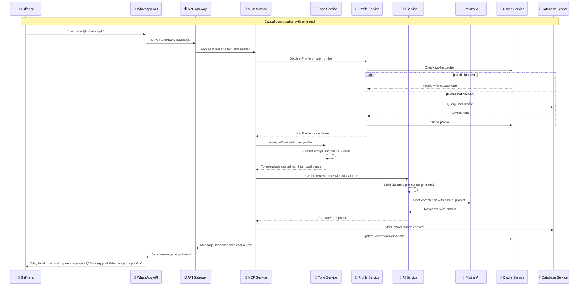
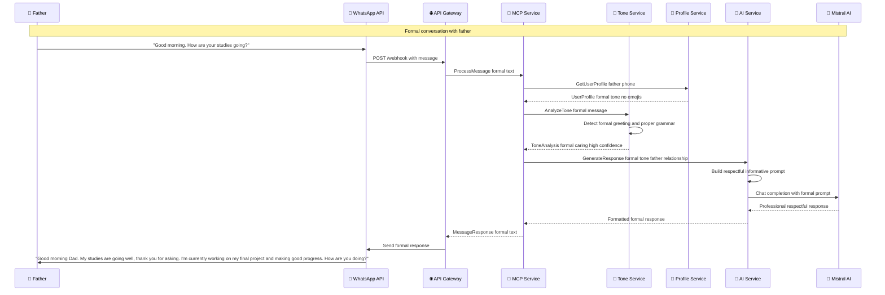

# WhatStyle 

### Sequence Diagram

Scenario 1 -> Girlfriend sends casual message

```mermaid
sequenceDiagram
    participant GF as 👩 Girlfriend
    participant WA as 📱 WhatsApp API
    participant Gateway as 🌐 API Gateway
    participant MCP as 🤖 MCP Service
    participant ToneService as 🎯 Tone Service
    participant ProfileService as 👤 Profile Service
    participant AIService as 🧠 AI Service
    participant MistralAPI as 🔮 Mistral AI
    participant CacheService as ⚡ Cache Service
    participant DBService as 🗄️ Database Service

    Note over GF, DBService: Casual conversation with girlfriend
    
    GF->>WA: "hey babe 😘 what's up?"
    WA->>Gateway: POST /webhook message
    Gateway->>MCP: ProcessMessage text and sender
    
    MCP->>ProfileService: GetUserProfile phone number
    ProfileService->>CacheService: Check profile cache
    
    alt Profile in cache
        CacheService-->>ProfileService: Profile with casual tone
    else Profile not cached
        ProfileService->>DBService: Query user profile
        DBService-->>ProfileService: Profile data
        ProfileService->>CacheService: Cache profile
    end
    
    ProfileService-->>MCP: UserProfile casual tone
    
    MCP->>ToneService: AnalyzeTone with user profile
    ToneService->>ToneService: Extract emojis and casual words
    ToneService-->>MCP: ToneAnalysis casual with high confidence
    
    MCP->>AIService: GenerateResponse with casual tone
    AIService->>AIService: Build dynamic prompt for girlfriend
    AIService->>MistralAPI: Chat completion with casual prompt
    MistralAPI-->>AIService: Response with emojis
    AIService-->>MCP: Formatted response
    
    MCP->>DBService: Store conversation context
    MCP->>CacheService: Update recent conversations
    
    MCP-->>Gateway: MessageResponse with casual text
    Gateway->>WA: Send message to girlfriend
    WA->>GF: "Hey love! Just working on my project 😊 Missing you! What are you up to? 💕"
```

```mermaid
sequenceDiagram
    participant Dad as 👨 Father
    participant WA as 📱 WhatsApp API
    participant Gateway as 🌐 API Gateway
    participant MCP as 🤖 MCP Service
    participant ToneService as 🎯 Tone Service
    participant ProfileService as 👤 Profile Service
    participant AIService as 🧠 AI Service
    participant MistralAPI as 🔮 Mistral AI

    Note over Dad, MistralAPI: Formal conversation with father
    
    Dad->>WA: "Good morning. How are your studies going?"
    WA->>Gateway: POST /webhook with message
    Gateway->>MCP: ProcessMessage formal text
    
    MCP->>ProfileService: GetUserProfile father phone
    ProfileService-->>MCP: UserProfile formal tone no emojis
    
    MCP->>ToneService: AnalyzeTone formal message
    ToneService->>ToneService: Detect formal greeting and proper grammar
    ToneService-->>MCP: ToneAnalysis formal caring high confidence
    
    MCP->>AIService: GenerateResponse formal tone father relationship
    AIService->>AIService: Build respectful informative prompt
    AIService->>MistralAPI: Chat completion with formal prompt
    MistralAPI-->>AIService: Professional respectful response
    AIService-->>MCP: Formatted formal response
    
    MCP-->>Gateway: MessageResponse formal text
    Gateway->>WA: Send formal response
    WA->>Dad: "Good morning Dad. My studies are going well, thank you for asking. I'm currently working on my final project and making good progress. How are you doing?"
```
