# WhatStyle 

## Sequence Diagram

**Scenario 1** -> Girlfriend sends casual message

**Scenario 2** -> Father sends formal message 

```mermaid
sequenceDiagram
    participant Dad as 👨 Father
    participant WA as 📱 WhatsApp API
    participant Gateway as 🌐 API Gateway
    participant MCP as 🤖 MCP Service
    participant ToneService as 🎯 Tone Service
    participant ProfileService as 👤 Profile Service
    participant AIService as 🧠 AI Service
    participant MistralAPI as 🔮 Mistral AI

    Note over Dad, MistralAPI: Formal conversation with father
    
    Dad->>WA: "Good morning. How are your studies going?"
    WA->>Gateway: POST /webhook with message
    Gateway->>MCP: ProcessMessage formal text
    
    MCP->>ProfileService: GetUserProfile father phone
    ProfileService-->>MCP: UserProfile formal tone no emojis
    
    MCP->>ToneService: AnalyzeTone formal message
    ToneService->>ToneService: Detect formal greeting and proper grammar
    ToneService-->>MCP: ToneAnalysis formal caring high confidence
    
    MCP->>AIService: GenerateResponse formal tone father relationship
    AIService->>AIService: Build respectful informative prompt
    AIService->>MistralAPI: Chat completion with formal prompt
    MistralAPI-->>AIService: Professional respectful response
    AIService-->>MCP: Formatted formal response
    
    MCP-->>Gateway: MessageResponse formal text
    Gateway->>WA: Send formal response
    WA->>Dad: "Good morning Dad. My studies are going well, thank you for asking. I'm currently working on my final project and making good progress. How are you doing?"
```

**Scenario 3** -> Brother sends sad message

```mermaid
sequenceDiagram
    participant Bro as 👦 Brother
    participant WA as 📱 WhatsApp API
    participant Gateway as 🌐 API Gateway
    participant MCP as 🤖 MCP Service
    participant ToneService as 🎯 Tone Service
    participant EmotionService as 😢 Emotion Service
    participant StickerService as 🎭 Sticker Service
    participant AIService as 🧠 AI Service
    participant MediaService as 🖼️ Media Service

    Note over Bro, MediaService: Brother is sad, respond with supportive sticker
    
    Bro->>WA: "failed my exam again 😭 feeling terrible"
    WA->>Gateway: POST /webhook sad message
    Gateway->>MCP: ProcessMessage with crying emoji
    
    MCP->>ToneService: AnalyzeTone sad text
    ToneService->>EmotionService: DetectEmotion text and crying emoji
    EmotionService-->>ToneService: Emotion sadness high intensity needs support
    ToneService-->>MCP: ToneAnalysis sad distressed requires empathy
    
    alt Emotional support needed
        MCP->>StickerService: GetSupportiveSticker emotion sad relationship brother
        StickerService->>StickerService: Select appropriate supportive sticker
        StickerService-->>MCP: Sticker hug sticker supportive virtual hug
        
        MCP->>AIService: GenerateEmpatheticResponse emotion sad context exam failure
        AIService-->>MCP: "Aw man, that sucks 😞 Don't worry bro, you'll get it next time! Want to talk about it?"
        
        MCP->>MediaService: PrepareMultiMediaResponse text and sticker
        MediaService-->>MCP: MultiMediaMessage with sticker and text
    end
    
    MCP-->>Gateway: MultiMediaResponse sticker and supportive text
    Gateway->>WA: Send sticker plus supportive message
    WA->>Bro: [🤗 Supportive Hug Sticker] + "Aw man, that sucks 😞 Don't worry bro, you'll get it next time! Want to talk about it?"
```

**Scenario 4** -> Real-time Tone learning and adaptation

```mermaid
sequenceDiagram
    participant User as 👤 User
    participant MCP as 🤖 MCP Service
    participant ToneService as 🎯 Tone Service
    participant MLService as 🤖 ML Service
    participant SparkService as ⚡ Spark Service
    participant VectorDB as 🔍 Vector DB
    participant AIService as 🧠 AI Service

    Note over User, AIService: System learns from conversation patterns
    
    User->>MCP: Series of messages over time
    MCP->>ToneService: AnalyzeTone conversation history
    
    ToneService->>MLService: UpdateUserToneProfile user id and new patterns
    MLService->>SparkService: ProcessToneEvolution user data
    
    par Real-time Learning
        SparkService->>SparkService: Analyze communication patterns
        SparkService->>VectorDB: Update tone embeddings
    and Batch Processing
        SparkService->>SparkService: Train personalized model
        SparkService->>MLService: UpdatedPersonalizedModel
    end
    
    MLService-->>ToneService: EnhancedToneProfile updated preferences new patterns
    ToneService-->>MCP: ImprovedToneUnderstanding
    
    Note over MCP: Next messages use improved understanding
    
    User->>MCP: New message
    MCP->>AIService: GenerateResponse enhanced profile
    AIService-->>User: More accurate personalized response
```

**Scenario 5** -> Group chat with multiple tone

**Error Handling and Fallback Sequence**

## Class Diagram

Core MCP Service Classes 

Tone Analysis Service Classes 

AI Response Generation Classes

Data Layer Classes

WhatsApp Integration Classes

Analytics and Monitoring Classes

Spark Integration Classes

## System Architecture

Mircoservice Architecture Overview with DataStax 

Service Communication Patterns 

```mermaid
graph LR
    subgraph "Synchronous gRPC"
        MCPSync[MCP Service] --> ToneSync[Tone Service]
        MCPSync --> UserSync[User Service]
        ToneSync --> AISync[AI Service]
    end
    
    subgraph "Asynchronous Messaging"
        ToneAsync[Tone Service] -->|Kafka| AnalyticsAsync[Analytics Service]
        ConvAsync[Conversation Service] -->|Kafka| MLAsync[ML Pipeline]
        UserAsync[User Service] -->|Kafka| NotifAsync[Notification Service]
    end
    
    subgraph "Event Streaming"
        KafkaTopics[📊 Kafka Topics<br/>• message-events<br/>• tone-updates<br/>• user-actions<br/>• system-metrics]
        
        SparkStream[⚡ Spark Streaming<br/>Real-time Processing]
        
        KafkaTopics --> SparkStream
        SparkStream --> KafkaTopics
    end
    
    subgraph "Caching Strategy"
        L1Cache[🔥 L1 Cache<br/>Application Memory]
        L2Cache[⚡ L2 Cache<br/>Redis Cluster]
        Database[(🗄️ Database<br/>DataStax Astra)]
        
        L1Cache -->|Miss| L2Cache
        L2Cache -->|Miss| Database
    end

```

Data Flow Architecture

State Management and Event Flow

Event Driven Architecture

```mermaid
graph TB
    subgraph "Event Sources"
        UserAction[👤 User Actions]
        SystemEvent[⚙️ System Events]
        ExternalAPI[🔌 External API Events]
        ScheduledJob[⏰ Scheduled Jobs]
    end
    
    subgraph "Event Bus"
        EventBus[📊 Kafka Event Bus<br/>Central Message Broker]
    end
    
    subgraph "Event Topics"
        MessageTopic[📬 message-events<br/>• message_received<br/>• message_sent<br/>• message_failed]
        
        ToneTopic[🎯 tone-events<br/>• tone_analyzed<br/>• profile_updated<br/>• model_trained]
        
        UserTopic[👤 user-events<br/>• user_created<br/>• profile_updated<br/>• preference_changed]
        
        SystemTopic[⚙️ system-events<br/>• service_started<br/>• error_occurred<br/>• health_check]
    end
    
    subgraph "Event Consumers"
        AnalyticsConsumer[📊 Analytics Consumer<br/>Real-time metrics]
        
        MLConsumer[🤖 ML Consumer<br/>Model training data]
        
        NotificationConsumer[🔔 Notification Consumer<br/>User alerts]
        
        AuditConsumer[📋 Audit Consumer<br/>Compliance logging]
        
        DashboardConsumer[📈 Dashboard Consumer<br/>Live updates]
    end
    
    subgraph "Event Processing"
        StreamProcessor[⚡ Stream Processor<br/>Real-time aggregation]
        
        BatchProcessor[📦 Batch Processor<br/>Scheduled analysis]
        
        CEPEngine[🔍 Complex Event Processing<br/>Pattern detection]
    end
    
    %% Event flow
    UserAction --> EventBus
    SystemEvent --> EventBus
    ExternalAPI --> EventBus
    ScheduledJob --> EventBus
    
    EventBus --> MessageTopic
    EventBus --> ToneTopic
    EventBus --> UserTopic
    EventBus --> SystemTopic
    
    MessageTopic --> AnalyticsConsumer
    MessageTopic --> AuditConsumer
    
    ToneTopic --> MLConsumer
    ToneTopic --> DashboardConsumer
    
    UserTopic --> NotificationConsumer
    UserTopic --> AnalyticsConsumer
    
    SystemTopic --> DashboardConsumer
    SystemTopic --> AuditConsumer
    
    AnalyticsConsumer --> StreamProcessor
    MLConsumer --> BatchProcessor
    DashboardConsumer --> CEPEngine
```

Deployment Architecture with DataStax

```mermaid
graph TB
    subgraph "Load Balancers"
        ELB[🌐 External Load Balancer<br/>AWS ALB / nginx]
        ILB[⚖️ Internal Load Balancer<br/>Service mesh / Istio]
    end
    
    subgraph "Kubernetes Cluster"
        subgraph "API Services Namespace"
            APIPod1[🤖 MCP Service Pod 1]
            APIPod2[🤖 MCP Service Pod 2]
            APIPod3[🤖 MCP Service Pod 3]
        end
        
        subgraph "AI Services Namespace"
            AIPod1[🧠 AI Service Pod 1]
            AIPod2[🧠 AI Service Pod 2]
            TonePod1[🎯 Tone Service Pod 1]
            TonePod2[🎯 Tone Service Pod 2]
        end
        
        subgraph "Data Services Namespace"
            UserPod[👤 User Service Pod]
            ConvPod[💬 Conversation Service Pod]
            AnalyticsPod[📊 Analytics Service Pod]
        end
        
        subgraph "Processing Namespace"
            SparkDriver[⚡ Spark Driver]
            SparkWorker1[⚡ Spark Worker 1]
            SparkWorker2[⚡ Spark Worker 2]
            SparkWorker3[⚡ Spark Worker 3]
        end
    end
    
    subgraph "Cloud Database Layer"
        DataStaxAstra1[(🗄️ DataStax Astra<br/>Multi-Region Node 1)]
        DataStaxAstra2[(🗄️ DataStax Astra<br/>Multi-Region Node 2)]
        DataStaxAstra3[(🗄️ DataStax Astra<br/>Multi-Region Node 3)]
        DataStaxVector[(🔍 DataStax Vector<br/>Embeddings Database)]
        
        RedisNode1[(⚡ Redis Node 1)]
        RedisNode2[(⚡ Redis Node 2)]
        RedisNode3[(⚡ Redis Node 3)]
    end
    
    subgraph "Message Queue"
        Kafka1[📊 Kafka Broker 1]
        Kafka2[📊 Kafka Broker 2]
        Kafka3[📊 Kafka Broker 3]
        Zookeeper[🔧 Zookeeper Ensemble]
    end
    
    subgraph "Monitoring Stack"
        PrometheusServer[📈 Prometheus Server]
        GrafanaServer[📊 Grafana Server]
        AlertManagerServer[🚨 AlertManager]
        ElasticStack[🔍 ELK Stack]
    end
    
    %% External traffic flow
    ELB --> ILB
    ILB --> APIPod1
    ILB --> APIPod2
    ILB --> APIPod3
    
    %% Internal service communication
    APIPod1 --> AIPod1
    APIPod2 --> AIPod2
    APIPod3 --> TonePod1
    
    AIPod1 --> UserPod
    AIPod2 --> ConvPod
    TonePod1 --> AnalyticsPod
    
    %% DataStax connections
    UserPod --> DataStaxAstra1
    ConvPod --> DataStaxAstra2
    AnalyticsPod --> DataStaxAstra3
    TonePod1 --> DataStaxVector
    TonePod2 --> DataStaxVector
    
    %% Redis connections
    APIPod1 --> RedisNode1
    APIPod2 --> RedisNode2
    APIPod3 --> RedisNode3
    
    %% Messaging
    TonePod1 --> Kafka1
    TonePod2 --> Kafka2
    AnalyticsPod --> Kafka3
    
    Kafka1 --> SparkDriver
    Kafka2 --> SparkWorker1
    Kafka3 --> SparkWorker2
    
    %% Monitoring
    APIPod1 -.-> PrometheusServer
    AIPod1 -.-> PrometheusServer
    TonePod1 -.-> PrometheusServer
    PrometheusServer --> GrafanaServer
    PrometheusServer --> AlertManagerServer
```

