# WhatStyle 

### Sequence Diagram

**Scenario 1** -> Girlfriend sends casual message

**Scenario 2** -> Father sends formal message 

```mermaid
sequenceDiagram
    participant Dad as 👨 Father
    participant WA as 📱 WhatsApp API
    participant Gateway as 🌠API Gateway
    participant MCP as 🤖 MCP Service
    participant ToneService as 🎯 Tone Service
    participant ProfileService as 👤 Profile Service
    participant AIService as 🧠 AI Service
    participant MistralAPI as 🔮 Mistral AI

    Note over Dad, MistralAPI: Formal conversation with father
    
    Dad->>WA: "Good morning. How are your studies going?"
    WA->>Gateway: POST /webhook with message
    Gateway->>MCP: ProcessMessage formal text
    
    MCP->>ProfileService: GetUserProfile father phone
    ProfileService-->>MCP: UserProfile formal tone no emojis
    
    MCP->>ToneService: AnalyzeTone formal message
    ToneService->>ToneService: Detect formal greeting and proper grammar
    ToneService-->>MCP: ToneAnalysis formal caring high confidence
    
    MCP->>AIService: GenerateResponse formal tone father relationship
    AIService->>AIService: Build respectful informative prompt
    AIService->>MistralAPI: Chat completion with formal prompt
    MistralAPI-->>AIService: Professional respectful response
    AIService-->>MCP: Formatted formal response
    
    MCP-->>Gateway: MessageResponse formal text
    Gateway->>WA: Send formal response
    WA->>Dad: "Good morning Dad. My studies are going well, thank you for asking. I'm currently working on my final project and making good progress. How are you doing?"
```

**Scenario 3** -> Brother sends sad message

```mermaid
sequenceDiagram
    participant Bro as 👦 Brother
    participant WA as 📱 WhatsApp API
    participant Gateway as 🌠API Gateway
    participant MCP as 🤖 MCP Service
    participant ToneService as 🎯 Tone Service
    participant EmotionService as 😢 Emotion Service
    participant StickerService as 🎭 Sticker Service
    participant AIService as 🧠 AI Service
    participant MediaService as ðŸ–¼ï¸ Media Service

    Note over Bro, MediaService: Brother is sad, respond with supportive sticker
    
    Bro->>WA: "failed my exam again 😭 feeling terrible"
    WA->>Gateway: POST /webhook sad message
    Gateway->>MCP: ProcessMessage with crying emoji
    
    MCP->>ToneService: AnalyzeTone sad text
    ToneService->>EmotionService: DetectEmotion text and crying emoji
    EmotionService-->>ToneService: Emotion sadness high intensity needs support
    ToneService-->>MCP: ToneAnalysis sad distressed requires empathy
    
    alt Emotional support needed
        MCP->>StickerService: GetSupportiveSticker emotion sad relationship brother
        StickerService->>StickerService: Select appropriate supportive sticker
        StickerService-->>MCP: Sticker hug sticker supportive virtual hug
        
        MCP->>AIService: GenerateEmpatheticResponse emotion sad context exam failure
        AIService-->>MCP: "Aw man, that sucks 😞 Don't worry bro, you'll get it next time! Want to talk about it?"
        
        MCP->>MediaService: PrepareMultiMediaResponse text and sticker
        MediaService-->>MCP: MultiMediaMessage with sticker and text
    end
    
    MCP-->>Gateway: MultiMediaResponse sticker and supportive text
    Gateway->>WA: Send sticker plus supportive message
    WA->>Bro: [🤗 Supportive Hug Sticker] + "Aw man, that sucks 😞 Don't worry bro, you'll get it next time! Want to talk about it?"
```

**Scenario 4** -> Real-time Tone learning and adaptation

**Scenario 5** -> Group chat with multiple tone

**Error Handling and Fallback Sequence**

```mermaid
sequenceDiagram
    participant User as 👤 User
    participant WA as 📱 WhatsApp API
    participant Gateway as 🌠API Gateway
    participant MCP as 🤖 MCP Service
    participant ToneService as 🎯 Tone Service
    participant AIService as 🧠 AI Service
    participant MistralAPI as 🔮 Mistral AI
    participant FallbackService as 🔄 Fallback Service
    participant LocalAI as 🠠Local AI

    Note over User, LocalAI: Handle API failures gracefully
    
    User->>WA: "How's your day going?"
    WA->>Gateway: POST webhook
    Gateway->>MCP: ProcessMessage
    
    MCP->>ToneService: AnalyzeTone
    ToneService-->>MCP: ToneAnalysis casual type
    
    MCP->>AIService: GenerateResponse
    AIService->>MistralAPI: API call
    
    Note over MistralAPI: API Failure Rate Limit
    MistralAPI-->>AIService: Error 429 Rate limit exceeded
    
    AIService->>FallbackService: HandleAPIFailure error rate limit
    FallbackService->>LocalAI: GenerateLocalResponse tone casual
    LocalAI-->>FallbackService: Basic but appropriate response
    FallbackService-->>AIService: FallbackResponse
    
    AIService-->>MCP: Response with fallback indicator
    MCP-->>Gateway: Response text and fallback source
    Gateway->>WA: Send response
    WA->>User: "Pretty good! Thanks for asking 😊"
    
    Note over FallbackService: Log for later retry
    FallbackService->>FallbackService: Queue for retry when API available
```

